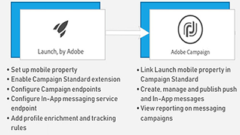

# Présentation

Adobe Campaign offre une plate-forme pour concevoir des expériences client cross-canal et propose un environnement pour l&#39;orchestration visuelle de campagnes, la gestion d&#39;interactions en temps réel et l&#39;exécution cross-canal. Ce guide d&#39;utilisation contient des vidéos et des didacticiels sur les nombreuses fonctionnalités d&#39;Adobe Campaign Standard.

## Nouveautés

* **[Activité d&#39;API externe](/help/managing-processes-and-data/data-management-activities/external-api-activity.md)**    
   *Découvrez comment configurer et exécuter un processus avec l&#39;activité API externe.*

* **[Substitution de Profil - Test des messages électroniques à l&#39;aide de profils ciblés](/help/communication-channels/email/profile-substitution.md)**    
   *Découvrez comment envoyer un BAT pour révision avec la représentation exacte du message que le profil recevra.*

* **[Panneau de configuration - Gestion des enregistrements Google TXT](/help/administrating/control-panel/google-txt-record-management.md)**    
   *Découvrez comment ajouter un enregistrement de vérification de site Google TXT à tous les sous-domaines utilisés pour envoyer des courriers électroniques aux adresses GMAIL via le Panneau de configuration Campaign.*

* **[Didacticiel : Prise en main des notifications Push pour Android](https://docs.adobe.com/content/help/en/campaign-standard-learn/getting-started-with-push-notifications-android/introduction.html)**    
   *Ce didacticiel vous guide tout au long des étapes nécessaires à l&#39;envoi de notifications Push en provenance d&#39;Adobe Campaign et à la réception de ces notifications dans votre application Android.*

## Sélection du personnel

<table>
<tr>
  <td>
    
    

      <a href="./communication-channels/mobile/in-app/in-app-message-overview.md">
    <strong>Messagerie in-app (didacticiel)</strong>
    </a>
    

    

    <em>La messagerie in-app est un canal qui vous permet d’afficher un message lorsque l’utilisateur est actif dans une application mobile.</em>
    

  </td>
   <td>
    
    

      <a href="./designing-content/email-designer/email-designer-overview.md">
    <strong>Concepteur de courriers électroniques (vidéos)</strong>
    </a>
    

    

    <em>Le Concepteur de courriers électroniques permet la création visuelle rapide et facile de courriels personnalisés.</em>
    

  </td>
  <td>
    
    

      <a href="./designing-content/product-listings-in-transactional-email.md">
    <strong>Listes de produits (didacticiel)</strong>
    </a>
    

    

    <em>Créez des courriers électroniques transactionnels avec une liste de produits et d’offres. </em>
    

  </td>
</tr>
</table>

## Ressources supplémentaires

* [Documentation](https://docs.adobe.com/content/help/fr-FR/campaign-standard/using/campaign-standard-home.html)
