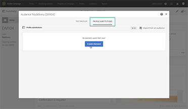
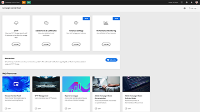
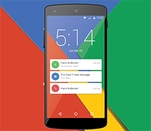

# Adobe Campaign Standard - Présentation

Adobe Campaign offre une plateforme pour concevoir des expériences client cross-canal et propose un environnement pour l’orchestration visuelle de campagnes, la gestion d’interactions en temps réel et l’exécution cross-canal. Ce guide de l’utilisateur contient des vidéos et des tutoriels sur les nombreuses fonctionnalités d’Adobe Campaign Standard.

## Nouveautés

* **[Suivre la réussite de vos diffusions dans Adobe Analytics](/help/integrations/track-the-success-of-your-deliveries-in-analytics.md)**

   *Découvrez comment configurer l’intégration du Campaign Standard et d’Analytics. Découvrez comment créer un rapport dans Analytics à l’aide des données reçues d’un Campaign Standard et quels IPC sont disponibles.*

* **[Utilisation de déclencheurs pour les messages transactionnels](/help/integrations/using-triggers-for-transactional-messaging-overview.md)**

   *Découvrez comment configurer et utiliser des triggers pour la messagerie transactionnelle.*

## Suggestions du personnel

<table>
<tr>
  <td>
    
    

      <a href="./communication-channels/email/profile-substitution.md">
   <strong> Substitution de profil - Test des emails à l’aide des profils ciblés(vidéo)</strong>
   </a>
    

    

    <em>Découvrez comment envoyer un BAT pour révision avec la représentation exacte du message que le profil recevra.</em>
    

  </td>
   <td>
    
    

    <a href="https://docs.adobe.com/content/help/fr-FR/campaign-standard-learn/control-panel/control-panel-overview.html">
    <strong>Panneau de contrôle (vidéos)</strong>
    </a>
    

    

    <em> Soyez plus efficace en tant qu’administrateur en gérant les paramètres et en suivant les utilisations de vos instances avec le panneau de contrôle.</em>
    

  </td>
  <td>
    
    

      <a href="https://docs.adobe.com/content/help/en/campaign-standard-learn/getting-started-with-push-notifications-android/introduction.html">
    <strong>Tutoriel : Prise en main des notifications push pour Android</strong>
    </a>
    

    

    <em>Ce tutoriel vous guide tout au long des étapes nécessaires à l’envoi de notifications push depuis Adobe Campaign et à la réception de ces notifications dans votre application Android. </em>
    

  </td>
</tr>
</table>

## Ressources supplémentaires

* [Documentation](https://docs.adobe.com/content/help/fr-FR/campaign-standard/using/campaign-standard-home.html)
